## Launching an Ubuntu EC2 Instance

## Metadata Information

| **Description**                                                                                                                                       | **Est. Read Time** | **Est. Lab Time** | **Est. Total Time** | **Keywords**               | **Author** | **Date**   | **Categories**                    | **Tags**                                        |
| ----------------------------------------------------------------------------------------------------------------------------------------------------- | ------------------ | ----------------- | ------------------- | -------------------------- | ---------- | ---------- | --------------------------------- | ----------------------------------------------- |
| A comprehensive guide on launching an Ubuntu EC2 instance, connecting to it from your local machine, and troubleshooting common errors along the way. | 10 - 15 min        | 7 - 15 min        | 17 - 30 min         | EC2, Ubuntu, AWS, SSH, WSL | BU         | 2025-12-27 | Cloud Computing, AWS, DevOps, WSL | EC2, AWS, Ubuntu, practical, DevOps, WSL, Linux |

---

**← Back to the theory <a href="../Concepts/Devops-02-EC2-Concept.md#metadata-information" target="_blank" rel="noreferrer noopener" title="Ctrl/Cmd‑click or Middle‑click to open in a new tab"> ← Concept → Devops-02-EC2-Concept - jump to "📊 Metadata Information </a>**

----------------------------------------------

### 📄 Summary

| #                                               | Topic                                 | Core Take‑aways                                                                                                                                                                                                                                                                                                                                                                                                                                                                                          |
| ----------------------------------------------- | ------------------------------------- | -------------------------------------------------------------------------------------------------------------------------------------------------------------------------------------------------------------------------------------------------------------------------------------------------------------------------------------------------------------------------------------------------------------------------------------------------------------------------------------------------------- |
| 1️⃣ **Launching an Ubuntu EC2 Instance**        | End‑to‑end console steps (free‑tier). | 1️⃣ Create/sign‑in to an AWS account. <br>2️⃣ Choose a region & give the instance a name. <br>3️⃣ Pick the **Ubuntu Server** AMI (Free‑Tier eligible). <br>4️⃣ Select **t2.micro** (Free‑Tier). <br>5️⃣ Create/download a **key pair** (*.pem*). <br>6️⃣ Set a **Security Group** that allows inbound **SSH (port 22)** from your IP. <br>7️⃣ Review storage (default 8 GiB root). <br>8️⃣ **Launch** the instance. <br>9️⃣ **Connect** via the pre‑filled SSH command in the console.                   |
| **2️⃣ Connecting from Windows with WSL**        | Using the Linux subsystem for SSH.    | a. `wsl --install` (PowerShell admin) → reboot. <br>b. Open the **Ubuntu** app (WSL Bash). <br>c. Copy the *.pem* key into `~/`. <br>d. `chmod 400 ~/your-keypair.pem`. <br>e. Run the console‑provided command: <br>`ssh -i "~/your-keypair.pem" ubuntu@ec2‑xx‑xx‑xx‑xx.compute-1.amazonaws.com\n` <br>f. When prompted **“Are you sure you want to continue connecting (yes/no)?”**, type **yes**. <br>g. You’ll see `ubuntu@<ip‑address>:~$`. <br>h. Basic Linux commands (`ls`, `cd`, `pwd`, `cat`). |
| **3️⃣ Linux Fundamentals on the Instance**      | Default users, prompts, and hostname. | • **root** – full admin (prompt `#`). <br>• **ubuntu** – non‑privileged default user (prompt `~$`). <br>• Hostname looks like `ip‑10‑0‑0‑123.ec2.internal`.                                                                                                                                                                                                                                                                                                                                              |
| 4️⃣ EC2 Ubuntu Launch & SSH: Top Errors & Fixes | Common errors & their Fixes           | 1️⃣. Permission denied (publickey) <br/>2️⃣ Connection timed out                                                                                                                                                                                                                                                                                                                                                                                                                                         |

---

### 1️⃣ ⚡ Step‑by‑Step: Launching an Ubuntu EC2 Instance

> **⚡ Quick tip:** All steps can be performed from the AWS Management Console. The screenshots are given below for reference.

| **Step** | **Action**                                            | **Details**                                                                                                                                                                                                                                                                                                                       |
| -------- | ----------------------------------------------------- | --------------------------------------------------------------------------------------------------------------------------------------------------------------------------------------------------------------------------------------------------------------------------------------------------------------------------------- |
| **1**    | **Create an AWS account (if you don’t have one yet)** | Go to the AWS Account Creation guide and follow the prompts to register a new account.🔗 **Docs:** [AWS Account Management](https://docs.aws.amazon.com/accounts/latest/reference/create-account.html)                                                                                                                            |
| **2**    | **Sign in to the AWS Management Console**             | Use your newly created (or existing) credentials to log in. 🔗 **Console sign‑in:**  [AWS Login](https://signin.aws.amazon.com/console)                                                                                                                                                                                           |
| **3**    | **Choose a Region & Name the instance**               | Pick a region (e.g., **us‑east‑1**) and give the instance a recognizable name such as `EC2-Ubuntu-Distro`.  <br/><br/>**Screenshot: - Region**<br/><br/><br/>**Screenshot:- Launch an Instance:**<br/><br/>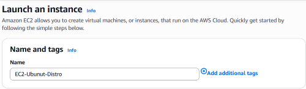 |
| **4**    | **Select the Amazon Machine Image (AMI)**             | Choose the **Ubuntu Server** AMI that is **Free‑Tier eligible**.    <br/><br/>**Screenshot:- Application and OS Images**<br/><br/>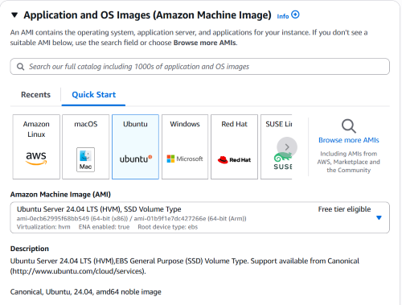<br/>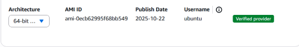                                     |
| **5**    | **Pick an Instance Type**                             | Select **t2.micro** (1 vCPU + 1 GiB RAM) – the free‑tier eligible option. <br/><br/>**Screenshot:- Instance type** <br/><br/>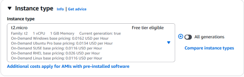                                                                                                                                         |
| **6**    | **Configure a Key Pair**                              | Create a new key pair (or reuse an existing one) and **download the** `.pem` **file**. This key will be used for SSH access.<br/><br/> **Screenshot:- Key Pair**<br/><br/>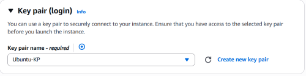                                                                                                 |
| **7**    | **Set Network & Security options**                    | Keep the default VPC/subnet unless you need a custom setup. Create a **Security Group** that allows inbound **SSH (port 22)** from your IP address. <br/><br/> **Screenshot:- Configure Storage** <br/><br/> 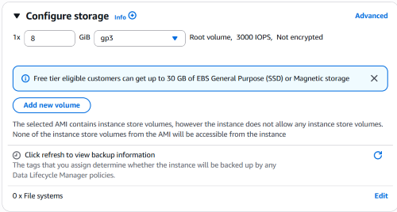                                                     |
| **8**    | **Review Storage settings**                           | Use the default 8 GiB root volume (or change the volume type to **gp3** for better performance). <br/><br/>**Sanitized screenshot:- Summay** <br/><br/>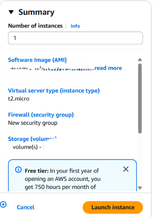                                                                                                                     |
| **9**    | **Launch instance and its sanitized screenshot**      | Review all settings and click **Launch instance**.<br/><br/>**Screenshot:- Launch Instance** <br/><br/>    <br/><br/> **Sanitized Screenshot:- Launched Instance** <br/><br/> 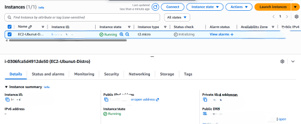                      |
| **10**   | **Connect via SSH – sanitized view of the SSH tab**   | After the instance is running, open the **Connect → SSH client** tab, copy the pre‑filled command, and run it from your terminal (or WSL on Windows) using the downloaded `.pem` file. <br/><br/> **Sanitized screenshot:- SSH Connect**  <br/><br/>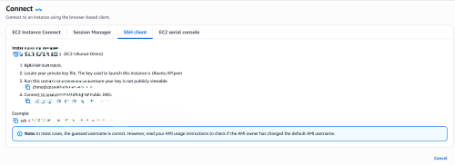                    |

### 2️⃣ 🐧 Connecting from Windows using **WSL**

| **Action**                                    | **Command / Explanation**                                                                                                                                                                                                                                                                                                                                                                                                                                                                                                                                                                                                                                                                                                                                                                                                                                                                                                                                                                                                                                    |
| --------------------------------------------- | ------------------------------------------------------------------------------------------------------------------------------------------------------------------------------------------------------------------------------------------------------------------------------------------------------------------------------------------------------------------------------------------------------------------------------------------------------------------------------------------------------------------------------------------------------------------------------------------------------------------------------------------------------------------------------------------------------------------------------------------------------------------------------------------------------------------------------------------------------------------------------------------------------------------------------------------------------------------------------------------------------------------------------------------------------------ |
| **a. Install WSL (if not already installed)** | Open **PowerShell as Administrator** and run:<br><br/>`wsl --install`<br><br/>This installs the latest Ubuntu distribution and sets up the required components. Reboot when prompted.<br/><br/>**Sanitized view: WSL install command in PowerShell** <br/><br/>                                                                                                                                                                                                                                                                                                                                                                                                                                                                                                                                                                                                                                                                                                                            |
| **b. Launch Ubuntu (WSL)**                    | After reboot, Open Windows Search, type “WSL”. In the results list, find the Command heading and click the WSL entry underneath it. Right‑click that entry and choose Run as administrator.<br/><br/>**Sanitized view – WSL command run from Windows Search** <br/><br/> <br/>                                                                                                                                                                                                                                                                                                                                                                                                                                                                                                                                                                                                                                           |
| **c. Move the `.pem` file into WSL**          | Copy the downloaded key to a safe location inside WSL, e.g.:<br><br/> `cp /mnt/c/Path/To/your-keypair.pem ~/` <br/><br/> **Sanitized view – copy command from a Windows path to a WSL path** <br/><br/>                                                                                                                                                                                                                                                                                                                                                                                                                                                                                                                                                                                                                                                                                                                                                                                     |
| **d. Set correct permissions**                | `chmod 400 ~/your-keypair.pem`<br/><br/> **Sanitized view – `chmod` command**  <br/><br/>                                                                                                                                                                                                                                                                                                                                                                                                                                                                                                                                                                                                                                                                                                                                                                                                                                                                                                        |
| **e. Connect via SSH**                        | Use the command copied from the AWS console, adjusting the path to the key:<br><br/>`ssh -i "~/your-keypair.pem" ubuntu@ec2-xx-xx-xx-xx.compute-1.amazonaws.com`  <br/><br/>1. Run the above ssh -i command <br>2. When the “Are you sure you want to continue connecting (yes/no)?” prompt appears, type yes and press Enter. <br>3. The connection will be established and the host key will be saved for future sessions.                                                                                                                                                                                                                                                                                                                                                                                                                                                                                                                                                                                                                                 |
| **f. Verify connection**                      | You should see a prompt like ubuntu@ipaddress:\~$ after completing the steps below. <br/><br/>1.    Navigate to the directory that contains the .pem file (for example, cd /home/ubuntu. <br/>2. Set the proper permissions on the key file:<br/>3. Paste the copied sshi -i command from the console's SSH Client tab.<br/> ```chmod 400 <your‑keypair.pem>``` <br/> (replace <your‑keypair.pem> with the actual filename you copied into WSL).<br/>4.  Paste the SSH command you copied from the AWS console’s “SSH Client” tab (it will look like ssh -i "~/your-keypair.pem" ubuntu@ec2‑xx‑xx‑xx‑xx.compute‑1.amazonaws.com).<br/>5. When the following prompt appears, type yes and press Enter:<br/>6. Are you sure you want to continue connecting (yes/no)?<br/>7. After you confirm, the connection is established and you will see the shell prompt - ubuntu@ipaddress:\$ <br/><br/>**Sanitized view – `ssh -i` command and its output** <br/><br/>  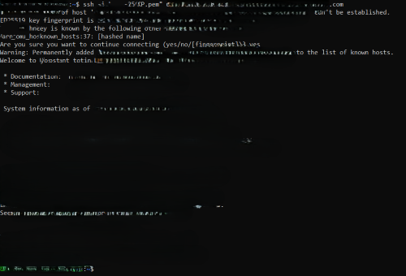 |
| **g. Basic Linux commands**                   | • `ls` – list files/directories.<br>• `cd <dir>` – change directory.<br>• `pwd` – print current path.<br>• `cat <file>` – view file contents.                                                                                                                                                                                                                                                                                                                                                                                                                                                                                                                                                                                                                                                                                                                                                                                                                                                                                                                |

### 3️⃣ 🐧 Linux Fundamentals on the Instance

| **User**           | **Default login**                      | **Description**                                                                                                                                 |
| ------------------ | -------------------------------------- | ----------------------------------------------------------------------------------------------------------------------------------------------- |
| **root**           | `root`                                 | System‑administrator account with full privileges.                                                                                              |
| **ubuntu**         | `ubuntu`                               | Non‑privileged default user that comes with the official Ubuntu Server AMI.                                                                     |
| **Prompt symbols** | `~$` (regular user) `#` (root)         | `~$` indicates you’re logged in as the `ubuntu` user (home directory). `#` appears when you switch to the root account (e.g., via `sudo su -`). |
| **Hostname**       | `ip‑10‑0‑0‑123.ec2.internal` (example) | The internal DNS name assigned to the instance; varies per instance and region.                                                                 |

---

### 4️⃣ **Stop the Instance for Future Labs**

For the next hands‑on projects we’ll stop the instance (instead of terminating it) so the same environment can be resumed later—sanitized screenshot is given below.

| #                                          | Screenshot                                                                                                                                                                                                                                                                               |
| ------------------------------------------ | ---------------------------------------------------------------------------------------------------------------------------------------------------------------------------------------------------------------------------------------------------------------------------------------- |
| **1 – Show “Stop Instance” action**        | **Sanitized screenshot:- Stop Instance**<br/><br/>The user clicks the **Stop Instance** button (or menu item) in the cloud console. This initiates the shutdown workflow.<br/><br/>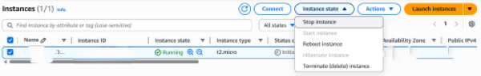                                          |
| **2 – Confirm stop in dialog**             | **Sanitized screenshot:- Stop in dialog**<br/><br/>A confirmation dialog appears. The user clicks on **Stop**  to confirm that the instance should be stopped rather than terminated.<br/><br/>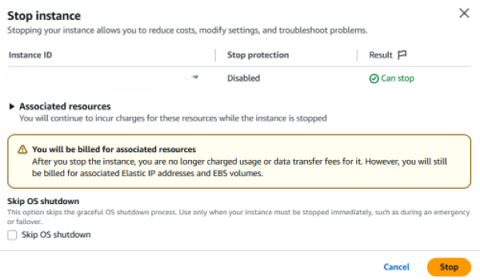                     |
| **3 – Instance entering “Stopping” state** | **Sanitized screenshot:- Instance entering “Stopping” state**<br/><br/>After confirming, the UI shows a status indicator reading **Stopping…** while the platform gracefully shuts down the VM.<br/><br/> |
| **4 – Instance now “Stopped”**             | **Sanitzied screenshot:- Instance “Stopped”**<br/><br/>Once the shutdown completes, the status changes to **Stopped**, indicating the environment can be resumed later.<br/><br/>                                   |

-------------

### 5️⃣ **EC2 Ubuntu Launch & SSH: Top Errors & Fixes**

| #                                       | Symptom (what you’ll see)                                 | Why it happens                                                                                                                                                | Fix                                                                                                                                                               |
| --------------------------------------- | --------------------------------------------------------- | ------------------------------------------------------------------------------------------------------------------------------------------------------------- | ----------------------------------------------------------------------------------------------------------------------------------------------------------------- |
| **1️⃣ “Permission denied (publickey)”** | SSH aborts immediately after you run `ssh -i … ubuntu@…`. | The key you’re using doesn’t match the key pair attached to the instance, the key file’s permissions are too lax, **or** you’re logging in as the wrong user. | • Verify you’re using the exact `.pem` that belongs to the instance. • Run `chmod 400 ~/your‑key.pem`. • Use the correct default user (`ubuntu` for Ubuntu AMIs). |
| **2️⃣ “Connection timed out”**          | The SSH command hangs and eventually times out.           | The instance’s **security group** does not allow inbound TCP 22 from your public IP, or the instance has no public IPv4 address.                              | • In the EC2 console, edit the instance’s security group → Inbound → Add **SSH**                                                                                  |

**Quick checklist :**

1. **Security group** – keep it minimal (SSH from your IP).
2. **Key file** – `chmod 400` and use the matching `.pem`.
3. **Connect** – run the console‑provided `ssh -i …` command; you should land at `ubuntu@<public‑dns>:~$`.

These three points cover the most common roadblocks and give you a fast path to a working, secure EC2 instance.

--------------

### ❓ Question & Answer

| #      | Question                                                                                 | Answer                                                                                                                                                                                          |
| ------ | ---------------------------------------------------------------------------------------- | ----------------------------------------------------------------------------------------------------------------------------------------------------------------------------------------------- |
| **Q1** | *Which EC2 instance type is free‑tier eligible for Ubuntu, and what are its specs?*      | **t2.micro** – 1 vCPU (burstable) and 1 GiB RAM. It is covered by the AWS Free Tier for up to 750 hours per month.                                                                              |
| **Q2** | *What must you do the first time you SSH to a new EC2 host?*                             | Answer **yes** to the prompt “Are you sure you want to continue connecting (yes/no)?” so the host’s fingerprint is stored in `~/.ssh/known_hosts`.                                              |
| **Q3** | *Why do we set the PEM file’s permission to 400?*                                        | Permission 400 makes the file readable only by the owner, satisfying SSH’s security requirement and preventing other users from accessing the private key.                                      |
| **Q4** | *What is the difference between the `ubuntu` user and the `root` user on an Ubuntu AMI?* | `ubuntu` is a regular, non‑privileged account (prompt `~$`). `root` is the system‑administrator account with unrestricted privileges (prompt `#`). `ubuntu` can become root via `sudo`.         |
| **Q5** | *How does WSL make it easier to SSH from a Windows machine?*                             | WSL provides a native Linux environment with the standard `ssh` client, eliminating the need for a separate Windows SSH client and letting you use the same commands you’d run on a Linux host. |

------------

**← Back to the theory <a href="../Concepts/Devops-02-EC2-Concept.md#metadata-information" target="_blank" rel="noreferrer noopener" title="Ctrl/Cmd‑click or Middle‑click to open in a new tab"> ← Concept → Devops-02-EC2-Concept - jump to "📊 Metadata Information </a>**

------------------------------
